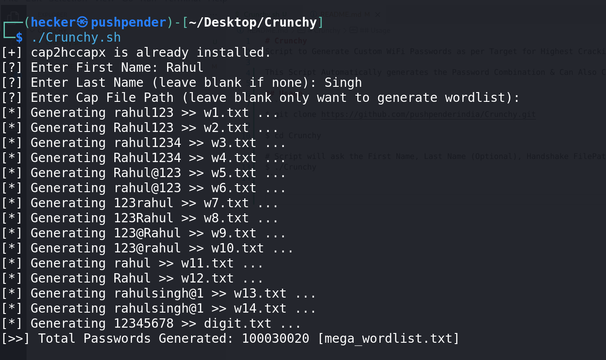

# Crunchy
Script to Generate Custom WiFi Passwords as per Target for Highest Cracking Possiblity

This Script Automatically generates the Password Combination & Can Also Crack the Handshake for you

## What is Handshake ?
In layman terms, its basically Hashed password which you get by Intercepting the Communication between the WiFi Owner & WiFi Router

After Capturing this handshake using tools such as AirCrack-ng, you have to crack the Hashed Password (Handshake) using a Wordlist 

## What this script does ?
It helps you in creating high success rate wordlist, this tool will only help if the target WiFi is using a Weak Password.

## Why to Capture Handshake ?
Well you can directly attempt to guess password but after some attempt, Router will block you or drop your attempts

Even though it doesn't drop your attempts, it will take Forever

Because of Cracking speed (Hardly 2-5 passwords a Minute)

If you've 1080 Ti (8 GB VRAM), then you could get roughly 47,876 MH/s i.e. 47,876 Millions of Hashes per seconds

That's a Crazy number,

In this video, Kevin Mitnick has shown with a demo of HashCat to prove this number: https://www.youtube.com/watch?v=K-96JmC2AkE

And there is no limit of cracking speed, you could run the hash cracking on Powerful Rented Server with maybe 128 GB of Graphic Card!

That how easy it is to Crack a Password at a speed of Billions per seconds 

## Usage
```
$ git clone https://github.com/pushpenderindia/Crunchy.git

$ cd Crunchy

# Script will ask the First Name, Last Name (Optional), Handshake FilePath (Optional)
$ ./Crunchy 
```

## Screenshot



## If Crunchy Fails ?

- If you are unable to crack password using this script
- Then try downloading a wordlist from this website:
- https://weakpass.com/
- If Still not getting success, then Move to another target or Try Any Other Method (Evil Twin, etc)